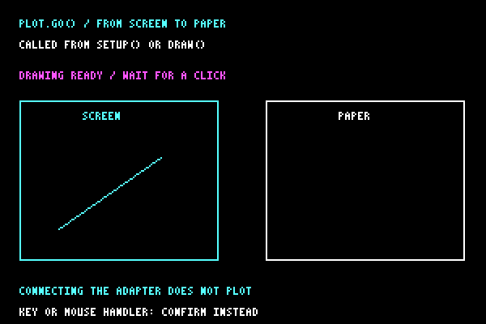

# p5.penplotter


**[Open site](https://seb-prjcts-be.github.io/p5.penplotter/)** · **[Setup](https://seb-prjcts-be.github.io/p5.penplotter/docs/setup.html)** · **[Examples](https://seb-prjcts-be.github.io/p5.penplotter/docs/examples.html)** · **[vanilla.penplotter](https://github.com/seb-prjcts-be/vanilla.penplotter)**

You sketch in p5.js the way you always do. Write `plot.line()` instead of `line()` and the same line is drawn on the canvas and remembered in millimetres.

Call `plot.go()` when the drawing is ready, then click the drawing to start plotting. No intermediate SVG is required for direct plotting.

## Two ways to work

Draw everything and plot once. Or draw and plot one object, wait until it finishes, then make the next. With separate `go()` calls, use `plot.clear()` before a new object; otherwise earlier objects are plotted again. `plot.sequence()` clears automatically before asking for the next object. Clear does not remove ink. The [Guide](https://seb-prjcts-be.github.io/p5.penplotter/docs/guide.html#werkwijzen) shows both ways.

## Which library?

**p5.penplotter** connects the engine to p5.js. Use it when you want to draw with supported p5 shapes and send them to the pen with `plot.go()`.

**[vanilla.penplotter](https://github.com/seb-prjcts-be/vanilla.penplotter)** is the engine. Use it for your own JavaScript, arrays of points or supported SVG geometry. It has no dependencies and works without p5.js.

Each job is prepared before plotting. `plot.sequence()` calculates one object, plots it and waits before preparing the next. Live streaming is not implemented; [live drawing notes](https://seb-prjcts-be.github.io/vanilla.penplotter/docs/live.html) describe the proposed direction.

## Install

The current browser bundle is v0.3.1. Load it from the fixed release URL below.

```html
<script src="https://cdn.jsdelivr.net/npm/p5@2.2.2/lib/p5.js"></script>
<script type="module">
  import { install } from "https://cdn.jsdelivr.net/gh/seb-prjcts-be/p5.penplotter@v0.3.1/dist/p5.penplotter.js";
  install(p5);
</script>
<script src="sketch.js"></script>
```

The browser bundle contains the adapter, vanilla.penplotter 0.5.0 and the EBB and DrawCore drivers. p5.js stays separate. Keep the release tag fixed so the sketch continues to use the same code. The exact core commit is recorded in `browser/core-source.json`.

Preview and export work without connecting a plotter. Web Serial is opened only after a user gesture. The original `installP5Penplotter(p5, PlotterEngine, { driver })` API remains available from the root adapter module for explicit integrations.

The [Setup](https://seb-prjcts-be.github.io/p5.penplotter/docs/setup.html) page includes a complete editor file and the physical starting instructions. Module variants are at the end of the [Guide](https://seb-prjcts-be.github.io/p5.penplotter/docs/guide.html#advanced-setups).

## Quick start

With the scripts above in `index.html`, use this `sketch.js`:

```js
let plot;

function setup() {
  createCanvas(400, 400);
  plot = createPlot({ paper: "A4", width: 100 });
  noLoop();
}

function draw() {
  background(255);
  noFill();
  plot.circle(200, 200, 300);
  plot.showBed();
  plot.go();
}
```

This example centres A4 paper on the configured machine bed. Set `paper` to the format on your plotter. `showBed()` displays the drawing's placement.

`width: 100` makes the canvas 100 mm wide on paper. This circle has a diameter of 75 mm.

### Click to plot

<p align="center">
  
</p>

`plot.go()` waits for a click when called from `setup()` or `draw()`. Check the machine, then click the drawing. The browser asks for a serial port when needed. A click while plotting requests a stop.

Park the carriage in the home corner by hand first; the machine has no home position of its own.

See [the physical starting corner in Setup](https://seb-prjcts-be.github.io/p5.penplotter/docs/setup.html#machine-origin). Moving the carriage to another corner does not reverse the motor directions.

The plot contains the shape calls recorded since the last `plot.clear()`. Clear at the start of `draw()` to replace each frame, and use `noLoop()` for a stable drawing. Screen transforms and styling are not recorded.

Tested on iDraw HSE / A2 (EBB firmware 3.0.2) on 2026-09-21. Plotted from the p5.js Web Editor on 2026-10-01. Small DrawCore tests on an A3 H passed on 2026-10-05.

Examples start on A4 and fit the canvas inside its margins. Change `paper` to use another sheet; optional machine settings are shown as comments in the sketches. Paper dimensions do not set the machine travel. The calibration sheet keeps a fixed 200 × 280 mm canvas so its ruler stays in millimetres.

Automatic paper placement is recalculated after connecting, using the selected driver's configured bed. Recorded geometry moves with the paper without changing scale. Explicit `paperX`, `paperY`, `x` and `y` remain unchanged; positions that do not fit are rejected before plotting.

## A3 H with DrawCore

The same brand can contain a different controller. When you connect, the library reads its version and chooses the EBB or DrawCore driver. `paper: "A4"` sets the default paper; the machine settings below set its movement and pen heights.

Replace the `createPlot()` line in `setup()` with this configuration for the tested A3 H:

```js
plot = createPlot({
  paper: "A4", margin: 12,
  drawcore: {
    travel: { width: 420, height: 297 },
    penUp: 0.5, penDown: 5, penFeed: 1000,
    drawFeed: 600, travelFeed: 900,
    axes: { swapXY: true, xDirection: -1, yDirection: -1 }
  }
});
```

Leave `width` out to fit the drawing inside the paper margins. Your drawing calls and `plot.go()` stay the same. Set the XY work origin before plotting; DrawCore does not take the carriage's current position as zero automatically. The [A3 H test page](docs/drawcore-test.html) lets you read the controller, test the pen and set that origin before trying a short line.

A 10 mm line and square, pen movement and return to the origin were tested with DrawCore V2.09. Larger drawings and stopping during motion still need a physical test. Stop lets accepted moves finish, raises the pen, then confirms Idle. This is a controlled stop, not an immediate emergency stop. Errors and emergencyStop request feed-hold, which does not guarantee penlift. Plot commands use `commandTimeoutMs` (default 120000 ms); identity and status queries retain short timeouts. The newest controlled stop with penlift has not been physically confirmed. DrawCore supports one drawing at a time; `plot.sequence()` and automatic resume are not implemented for it.

## Requirements

The browser examples use the bundled core. Building and source-level integration tests need the pinned sibling checkout. The source adapter still accepts the minimum versions listed below.

<!-- vereisten:start -->
| component | requires | note |
|---|---|---|
| `vanilla.penplotter` | nothing | no dependencies; works without p5.js. Node ≥ 18 only to run the tests |
| `p5.penplotter` | vanilla.penplotter ≥ 0.2.0 | the adapter contains no plotting or machine code; with a driver attached it refuses an older core with a clear message |
| `p5.penplotter` | p5.js ≥ 2.2.2 | tested with 2.2.2, in global and instance mode |
| direct plotting | Chrome or Edge, on `localhost` or https | Web Serial; the browser shows its port list only after a click or keypress |
| direct plotting | iDraw HSE / A2 (EBB 3.0.2), A3 H (DrawCore V2.09) | HSE/A2 profile tested; A3 H small plots tested with explicit settings |
| examples | wave formulas, vanilla.waves (pinned commit) | examples only; neither library depends on them |

The release bundles `vanilla.penplotter` 0.5.0 with `p5.penplotter` 0.3.1. Automated comparisons cover plans, SVG and EBB commands against adapter 0.2.2. The A3 H physical test used the development bundle before the release; its log is kept in vanilla.penplotter.

The browser examples load the fixed release bundle, which includes its core and driver. They do not load a sibling library or resolve the latest commits at startup.
<!-- vereisten:end -->

## Instance mode

```js
import { install } from "https://cdn.jsdelivr.net/gh/seb-prjcts-be/p5.penplotter@v0.3.1/dist/p5.penplotter.js";
install(p5);

new p5(function sketch(p) {
  let plot;

  p.setup = function () {
    p.createCanvas(400, 400);
    plot = p.createPlot({ paper: "A4", width: 100 });
    p.noLoop();
  };

  p.draw = function () {
    p.background("#ffffff");
    p.stroke("#111111");
    p.noFill();

    plot.circle(200, 200, 300);
    plot.showBed();
    plot.go();   // ready: click the drawing to plot, click again to stop
  };
});
```

## Shapes and fills

`plot.…` supports these p5 shapes, using their p5 arguments: `point`,
`line`, `circle`, `ellipse`, `arc`, `rect`, `square`, `triangle`, `quad`.
Points for `polyline` and `polygon` may be `[x, y]` or `{ x, y }`.
Angles follow `angleMode()`.

```js
plot.point(20, 20);
plot.square(30, 10, 40);
plot.triangle(80, 50, 120, 10, 160, 50);
plot.ellipse(260, 30, 60, 30);
plot.arc(330, 30, 40, 40, 0, HALF_PI, PIE);
plot.polygon([[0, 0], [40, 0], [40, 40]]);
```

`point()` is recorded as a short dash, about a quarter of a millimetre. An ellipse is recorded as a polyline with 96 segments.

Fills come from the engine and are drawn back onto the canvas, so screen and paper show the same hatching. The spacing is in millimetres on the bed, not in pixels:

```js
let square = [[20, 80], [120, 80], [120, 180], [20, 180]];
plot.hatch(square, 3, PI / 4);   // spacing in mm, angle
plot.crossHatch(square, 4);      // second direction perpendicular to the first
plot.stipple(square, 150, 3);    // count, seed: same seed, same dots
```

## Sampling a wave

`Math.sin()` returns a number. Build ordinary points with it and pass them on:

```js
const points = [];
for (let x = 40; x <= 760; x += 4) {
  points.push({
    x,
    y: 400 + 80 * Math.sin(x * 0.04)
  });
}
plot.polyline(points);
```

## Examples

Each one is a standalone page under `examples/`; the [examples page](https://seb-prjcts-be.github.io/p5.penplotter/docs/examples.html) shows them live.

Start with the two ways to work:

- `direct_plot` - draw everything, then click to plot with `plot.go()`
- `chaos_game` - calculate one point, plot it and wait before the next with `plot.sequence()`

Then vary the drawing:

- `molnar_grid` - nested squares that drift and turn a little more with every row
- `calibration_sheet` - ruler, tone scales, circles and line spacing: what your pen does on your paper
- `wave_field` - streamlines through a sampled direction field; a seed chooses the field
- `spirograph` - three hypotrochoids, each one unbroken polyline

To check placement before clicking to plot:

- `first_plot` (Plot preview) - a hatched polygon and a circle
- `wave_plot` (Wave plot preview) - 24 rows sampled from a wave formula

## Related work

See [About](https://seb-prjcts-be.github.io/p5.penplotter/docs/about.html#related-work) for p5.plotSvg, p5.plotterControl and the sister libraries.

## Public API

- `installP5Penplotter(p5, PlotterEngine, { driver })`: connects the adapter to p5.js and the core engine; `driver` is optional and only needed for `plot.go()`.
- `createPlot(options)`: creates a `P5Plot` that draws supported shapes on screen and records them in millimetres. Its `engine` is the underlying `PlotterEngine`.
- `createPlotterEngine(options)`: creates a bare engine with, by default, the current canvas size and `px` as unit.
- `drawRoute(plan, options)`: draws the route: the plan as the machine will draw it, via p5.js. Also `drawPlotPlan()`.
- `plot.sequence(prepare, options)`: one click starts successive jobs. Before each job, clears the recording and calls `prepare(index)`. Draw one object and return `true`; return `false` when finished. The carriage returns home after the last object. A click while running stops the sequence.
- `plot.showBed([canvas])`: shows the bed, paper and planned strokes with a small red cross at the origin. Without a canvas, it creates a separate preview and reuses it on redraw. Call it after recording the drawing.
- `plot.drawBed(canvas, { sheet })`: draws the planned strokes on the bed. Optional `sheet` describes actual paper with `x`, `y`, `width` and `height` in millimetres. By default it uses `plot.paper` when paper was selected, otherwise the mapped canvas area. Preview never scales or moves the drawing.
- `drawPlanWithP5(p, plan, options)`: the same renderer without the prototype helper.

`createPlot()` options: `paper`, `margin`, `orientation`, `paperX`, `paperY`, `width` or `mmPerPixel`, `x`, `y`, `profile`, `confirm`, `log`. Start with a paper format and margin; add a width when the drawing needs a fixed physical size. Use `clear()`, `plan()`, `connect()`, `go()` and `stop()` to control the job.

The [Guide](https://seb-prjcts-be.github.io/p5.penplotter/docs/guide.html#paper) explains paper formats, orientation and placement.

The browser bundle targets p5.js 2.2.2. The core and hardware status are determined solely by `vanilla.penplotter`.

## Test

```powershell
npm test
npm run docs
npm run manifest
```

`npm test` checks the adapter against a fake p5 and against the real engine in the sibling folder `../vanilla.penplotter` (or `VANILLA_PLOTTER_ROOT`), every local link on the site, that every example is in the gallery and the manifest, and that the generated architecture page is current.

## How this was made

Written with AI assistance, under the direction of Sebastien Vanblaere. Physical plotting tests use the iDraw HSE / A2. See [About](https://seb-prjcts-be.github.io/p5.penplotter/docs/about.html).

MIT License.

Sebastien Vanblaere

## Build and validate the browser bundle

See [the bundle workflow](docs/cdn-bundle.md). The build pins its core commit in `browser/core-source.json`. Use Node 22 or newer and `npm ci --legacy-peer-deps`; the core is supplied by its sibling Git checkout rather than the npm registry.

## Stable CDN

Use the [stable CDN imports](docs/cdn-stable.md) to follow tested releases. Existing editor sketches need their import changed once. Keep a versioned URL for drawings that must reproduce the same code. The p5 bundle includes its own tested vanilla core.
