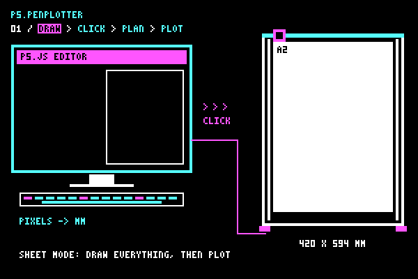
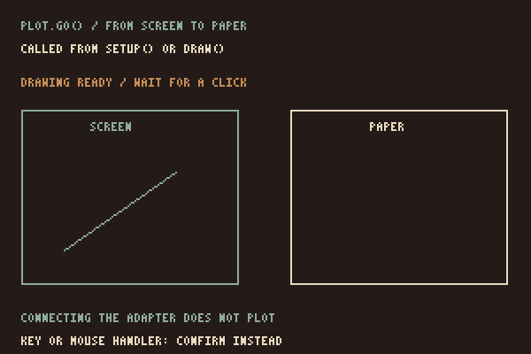

# p5.penplotter



**[Open site](https://seb-prjcts-be.github.io/p5.penplotter/)** · **[Setup](https://seb-prjcts-be.github.io/p5.penplotter/docs/setup.html)** · **[Examples](https://seb-prjcts-be.github.io/p5.penplotter/docs/examples.html)** · **[vanilla.penplotter](https://github.com/seb-prjcts-be/vanilla.penplotter)**

You sketch in p5.js the way you always do. Write `plot.line()` instead of `line()` and the same line is drawn on the canvas and remembered in millimetres.

Write `plot.go()` when the drawing is done, click it, and it goes to the plotter. No intermediate SVG is required for direct plotting.

## Twee manieren van werken

Alles tekenen, dan plotten: één volledige tekening vormt één job. Of één object tekenen en plotten, wachten tot de job klaar is en daarna een nieuwe opname maken voor het volgende object op hetzelfde papier. Een plot wist de opgenomen geometrie niet automatisch. De [Guide](https://seb-prjcts-be.github.io/p5.penplotter/docs/guide.html#werkwijzen) legt beide werkwijzen en hun grenzen uit. Dit zijn opeenvolgende complete jobs; live streaming tijdens een lopende job is nog niet geïmplementeerd.

## Which library?

**p5.penplotter** connects the engine to p5.js. Use it when you want to draw with supported p5 shapes and send them to the pen with `plot.go()`.

**[vanilla.penplotter](https://github.com/seb-prjcts-be/vanilla.penplotter)** is the engine. Use it for your own JavaScript, arrays of points or supported SVG geometry. It has no dependencies and works without p5.js.

The libraries prepare a complete drawing before plotting. Live streaming is not implemented; [live drawing notes](https://seb-prjcts-be.github.io/vanilla.penplotter/docs/live.html) describe the proposed direction.

### Screen and paper

`createPlot()`, `createPlotterEngine()` and `drawRoute()` become part of p5, in global and instance mode.

The shapes in millimetres, cleanup, route planning, exports and machine commands stay in `vanilla.penplotter`.

**Direct plotting is physically tested on one profile:** iDraw HSE / A2, EBB firmware 3.0.2, over Web Serial in Chrome or Edge. SVG, HPGL and G-code exports need software and settings suited to the receiving machine.

## Install

The site uses current source. The latest tags are core `v0.3.1` and adapter `v0.2.1`; newer `pen()`, `drawRoute()` and bed preview helpers are available on `main`, not in all tagged builds.

```html
<script src="https://cdn.jsdelivr.net/npm/p5@2.2.2/lib/p5.js"></script>
<script type="module">
  import { PlotterEngine } from "https://cdn.jsdelivr.net/gh/seb-prjcts-be/vanilla.penplotter@9f19656703c94dc970c0233135cdc9a66cda3f3f/vanilla.penplotter.js";
  import * as Ebb from "https://cdn.jsdelivr.net/gh/seb-prjcts-be/vanilla.penplotter@9f19656703c94dc970c0233135cdc9a66cda3f3f/src/driver/ebb.js";
  import { installP5Penplotter } from "https://cdn.jsdelivr.net/gh/seb-prjcts-be/p5.penplotter@3e7948bda7e7b9dbd9c7873805e8dee811260169/p5.penplotter.js";
  installP5Penplotter(p5, PlotterEngine, { driver: Ebb });
</script>
<script src="sketch.js"></script>
```

Pinned source commits, to keep the library versions fixed and include paper fitting and bed preview. Test your sketch with the pinned pair. The GitHub Pages URLs (`https://seb-prjcts-be.github.io/…`) always serve the latest `main`; the adapter checks the engine's version at install and refuses a core below the required minimum.

Leave out `{ driver: Ebb }` if you only preview.

All four ways of wiring a sketch, with the load-order timeline behind them, are on the [Setup](https://seb-prjcts-be.github.io/p5.penplotter/docs/setup.html) page.

## Quick start

A plain global-mode sketch, with the `<script>` tags above in `index.html`:

```js
let plot;

function setup() {
  createCanvas(400, 250);
  // where the canvas lands on the bed, in mm from the home corner, and how wide
  plot = createPlot({ x: 80, y: 150, width: 80 });
  noLoop();
}

function draw() {
  background(255);          // screen only: no `plot.` prefix, so it is not recorded
  plot.clear();             // new frame, new job
  plot.rect(10, 10, 380, 230);
  plot.line(30, 125, 370, 125);
  plot.go();                // the drawing is ready: click it to plot, click again to stop
}
```

### Click to plot

<p align="center">
  
</p>

`plot.go()` waits for a click when called from `setup()` or `draw()`. Check the machine, then click the drawing. The browser asks for a serial port when needed. A click while plotting requests a stop.

Park the carriage in the home corner by hand first; the machine has no home position of its own.

The plot contains the shape calls recorded since the last `plot.clear()`. Clear at the start of `draw()` to replace each frame, and use `noLoop()` for a stable drawing. Screen transforms and styling are not recorded.

Tested on one machine: iDraw HSE / A2 (EBB firmware 3.0.2) on 2026-09-21. Plotted from the p5.js Web Editor on 2026-10-01.

## Requirements

<!-- vereisten:start -->
| component | requires | note |
|---|---|---|
| `vanilla.penplotter` | nothing | no dependencies; works without p5.js. Node ≥ 18 only to run the tests |
| `p5.penplotter` | vanilla.penplotter ≥ 0.2.0 | the adapter contains no plotting or machine code; with a driver attached it refuses an older core with a clear message |
| `p5.penplotter` | p5.js ≥ 2.2.2 | tested with 2.2.2, in global and instance mode |
| direct plotting | Chrome or Edge, on `localhost` or https | Web Serial; the browser shows its port list only after a click or keypress |
| direct plotting | iDraw HSE / A2 with EBB firmware 3.0.2 | the only physically tested profile (`idraw-hse-a2`) |
| examples | wave formulas, vanilla.waves (pinned commit) | examples only; neither library depends on them |

Tested together: `vanilla.penplotter` 0.3.1 with `p5.penplotter` 0.2.1.

Publishing: always `vanilla.penplotter` first, then `p5.penplotter`. The examples of
`p5.penplotter` load the core as a sibling folder (`../vanilla.penplotter/`), locally under
`htdocs` and online on GitHub Pages. They therefore always get the latest core, not a
pinned one; the version check refuses a core below the required minimum.
<!-- vereisten:end -->

## Instance mode

```js
import { PlotterEngine } from "https://cdn.jsdelivr.net/gh/seb-prjcts-be/vanilla.penplotter@9f19656703c94dc970c0233135cdc9a66cda3f3f/vanilla.penplotter.js";
import * as Ebb from "https://cdn.jsdelivr.net/gh/seb-prjcts-be/vanilla.penplotter@9f19656703c94dc970c0233135cdc9a66cda3f3f/src/driver/ebb.js";
import { installP5Penplotter } from "https://cdn.jsdelivr.net/gh/seb-prjcts-be/p5.penplotter@3e7948bda7e7b9dbd9c7873805e8dee811260169/p5.penplotter.js";

installP5Penplotter(p5, PlotterEngine, { driver: Ebb });

new p5(function sketch(p) {
  let plot;
  p.setup = function setup() {
    p.createCanvas(600, 600);
    plot = p.createPlot({ x: 147, y: 66, width: 300 });
    plot.circle(300, 300, 400);
    plot.go();   // click the drawing to plot
    p.noLoop();
  };
});
```

## Shapes and fills

`plot.…` knows the same 2D shapes as p5, with the same arguments: `point`,
`line`, `circle`, `ellipse`, `arc`, `rect`, `square`, `triangle`, `quad`.
Points for `polyline` and `polygon` may be `[x, y]` or `{ x, y }`.
Angles follow `angleMode()`.

```js
plot.point(20, 20);
plot.square(30, 10, 40);
plot.triangle(80, 50, 120, 10, 160, 50);
plot.ellipse(260, 30, 60, 30);
plot.arc(330, 30, 40, 40, 0, HALF_PI, PIE);
plot.polygon([[0, 0], [40, 0], [40, 40]]);
```

A pen cannot make a dot, so `point()` becomes a dash of a quarter of a millimetre. An oval becomes a 96-gon, the way the engine itself flattens a circle.

Fills come from the engine and are drawn back onto the canvas, so screen and paper show the same hatching. The spacing is in millimetres on the bed, not in pixels:

```js
let square = [[20, 80], [120, 80], [120, 180], [20, 180]];
plot.hatch(square, 3, PI / 4);   // spacing in mm, angle
plot.crossHatch(square, 4);      // second direction perpendicular to the first
plot.stipple(square, 150, 3);    // count, seed: same seed, same dots
```

## Sampling a wave

`Math.sin()` returns a number. Build ordinary points with it and pass them on:

```js
const points = [];
for (let x = 40; x <= 760; x += 4) {
  points.push({
    x,
    y: 400 + 80 * Math.sin(x * 0.04)
  });
}
plot.polyline(points);
```

## Examples

Each one is a standalone page under `examples/`; the [examples page](https://seb-prjcts-be.github.io/p5.penplotter/docs/examples.html) shows them live.

- `direct_plot` - draw with `plot.…`, click the drawing, and the sketch goes to the plotter
- `first_plot` - create the engine from a p5 canvas and draw what the planner made of it
- `wave_plot` - 24 rows sampled from a wave formula
- `molnar_grid` - nested squares that drift and turn a little more with every row; a plain global-mode sketch
- `calibration_sheet` - ruler, tone scales, circles and line spacing: what your pen does on your paper
- `wave_field` - streamlines through a sampled direction field; a seed chooses the field
- `spirograph` - three hypotrochoids, each one unbroken polyline: the drawing a plotter was made for
- `chaos_game` - 1 500 dots that jump halfway to a random corner; plotted in the order of the game, the Sierpinski triangle appears on paper dot by dot

## Related work

[p5.plotSvg](https://github.com/golanlevin/p5.plotSvg) by Golan Levin exports a plotter-friendly SVG from a p5 sketch, with `beginRecordSvg()` and `endRecordSvg()`, and covers many more p5 primitives than this adapter. It drives no machine. `p5.penplotter` takes the other path: no file, but `plot.go()`. A p5.plotSvg file can be plotted by the engine's `svg_to_pen` example.

[p5.plotterControl](https://github.com/craigfahner/p5.plotterControl) (craigfahner) drives GRBL pen plotters live from p5.js. `p5.penplotter` targets EBB machines such as the iDraw HSE and plans the whole drawing before the pen moves.

## Public API

- `installP5Penplotter(p5, PlotterEngine, { driver })`: connects the adapter to p5.js and the core engine; `driver` is optional and only needed for `plot.go()`.
- `createPlot(options)`: creates a `P5Plot` that draws supported shapes on screen and records them in millimetres. Its `engine` is the underlying `PlotterEngine`.
- `createPlotterEngine(options)`: creates a bare engine with, by default, the current canvas size and `px` as unit.
- `drawRoute(plan, options)`: draws the route: the plan as the machine will draw it, via p5.js. Also `drawPlotPlan()`.
- `plot.drawBed(canvas, { sheet })`: draws the planned strokes on the bed. Optional `sheet` describes actual paper with `x`, `y`, `width` and `height` in millimetres. By default it uses `plot.paper` when paper was selected, otherwise the mapped canvas area. Preview never scales or moves the drawing.
- `drawPlanWithP5(p, plan, options)`: the same renderer without the prototype helper.

`createPlot()` options: `x`, `y`, `width` (mm on the bed) or `mmPerPixel`, `profile`, `confirm`, `log`. Use `clear()`, `plan()`, `connect()`, `go()` and `stop()` to control the job.

Choose paper directly with `createPlot({ paper: "A2", margin: 12 })`. A0–A6 dimensions come from the core's `PlotterEngine.paperSize()`. The canvas fits proportionally inside the paper margins and is centred on the sheet; the sheet is centred on the installed machine's bed. Default `orientation: "auto"` follows the canvas aspect ratio and tries the other orientation if needed to fit the bed. On the HSE/A2, A2 is 594 × 420 mm at X = 0, Y = 6 mm. Explicit `"portrait"` or `"landscape"` never flips silently. `paperX`/`paperY` move the sheet; `x`/`y` still locate the canvas. Positions and margins are millimetres; the default margin is 12. `width` or `mmPerPixel` overrides automatic fitting.

`plot.paper` reports the resolved format, orientation, dimensions, position and margin. `plot.drawBed(canvas)` uses that sheet automatically. Invalid paper placement, a canvas outside the margins or recorded strokes outside those margins are refused before direct plotting. Without a machine profile, paper starts at X/Y = 0. Without `paper`, existing mapping stays unchanged. This option requires current source in both libraries; earlier pinned builds do not include it.

Version 0.2.1 targets p5.js 2.2.2. The core and hardware status are determined solely by `vanilla.penplotter`.

## Test

```powershell
npm test
npm run docs
npm run manifest
```

`npm test` checks the adapter against a fake p5 and against the real engine in the sibling folder `../vanilla.penplotter` (or `VANILLA_PLOTTER_ROOT`), every local link on the site, that every example is in the gallery and the manifest, and that the generated architecture page is current.

## How this was made

Designed and directed by Sebastien Vanblaere, written with AI assistance, and held to one rule: nothing is claimed that a test or a plot on paper has not shown. See [About](https://seb-prjcts-be.github.io/p5.penplotter/docs/about.html).

MIT License.

Sebastien Vanblaere
