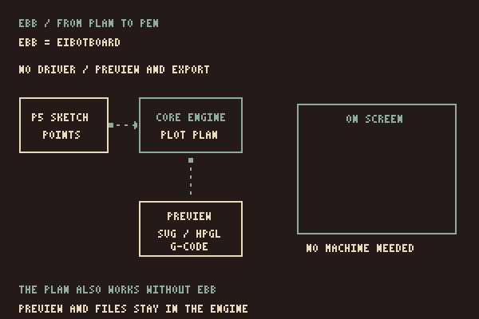

# How p5.penplotter works

## Screen and paper

You draw with p5.js. The supported `plot.line()`, `plot.circle()` and other shape calls draw on the canvas and also record points for the pen. `vanilla.penplotter` cleans up those points, plans their route and supplies the machine driver.

The adapter converts canvas coordinates to millimetres using the width and offset passed to `createPlot()`. A p5 circle takes a diameter; the core receives a radius. A point becomes a short dash on paper.

Paper and canvas area can have different sizes and positions. `plot.drawBed(canvas, { sheet: { x, y, width, height } })` shows the actual sheet in millimetres alongside the planned strokes. Without `sheet`, it shades the canvas area mapped by `createPlot()`. This preview does not alter the plan or rotate the drawing; p5 screen transforms are still not captured.

## What is recorded

The plot keeps the shapes recorded since the last `plot.clear()`. To record one frame, clear at its start. For a stable drawing, use `noLoop()` and redraw when you choose a new seed.

Screen transforms such as `translate()` and `rotate()`, p5 fill and stroke styling, and changes to `rectMode()` or `ellipseMode()` are not recorded. The pen geometry uses corner rectangles and centred ellipses. Use explicit coordinates and the plot's engine tools and layers for paper.

Hatch, crosshatch and stipple are generated by the core and drawn back onto the canvas. They are pen strokes, rather than p5 colour fills. Text, general Bézier curves and arbitrary p5 sketches are not captured.

## Starting a plot

When `plot.go()` is called from `setup()` or `draw()`, it waits for a click on the drawing. That click starts a plan from the recorded geometry, asks the browser for a serial port when needed, and runs the supplied driver. A click while plotting requests a stop. Calls from a key or mouse handler ask for confirmation instead.


The driver comes from `vanilla.penplotter`; this adapter contains no machine protocol. Direct plotting has been physically tested on an iDraw HSE / A2 with EBB firmware 3.0.2. The same core can preview and export a drawing without a connected plotter.

## Connecting the adapter

```js
installP5Penplotter(p5, PlotterEngine, { driver: Ebb });
```

Here, `Ebb` is the driver module imported from `vanilla.penplotter/src/driver/ebb.js`. EBB means EiBotBoard: the hardware controller that operates the plotter's motors and pen lift. The JavaScript driver translates a plan into commands and sends them through Web Serial over USB to a compatible controller.



The connection adds helpers to the p5 prototype for global and instance mode. `createPlotterEngine()` exposes the core, while `drawRoute()` draws its planned routes in p5. Pen-up travel belongs to the core preview.

The adapter checks its minimum dependencies, not every possible version combination. The site's examples load current source from the neighbouring core repository. For your own project, pin both libraries and test the pair. The [Setup](setup.html) page shows the load order and wiring.

## What stays in the core

Geometry, SVG import, cleanup, route planning, file exports, machine profiles and drivers live in `vanilla.penplotter`. Fixes belong there rather than being copied into the adapter. See the [core architecture](https://seb-prjcts-be.github.io/vanilla.penplotter/docs/architecture.html) for its current scope.
